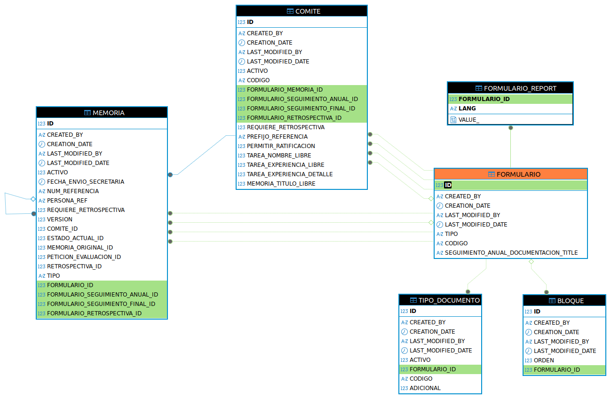
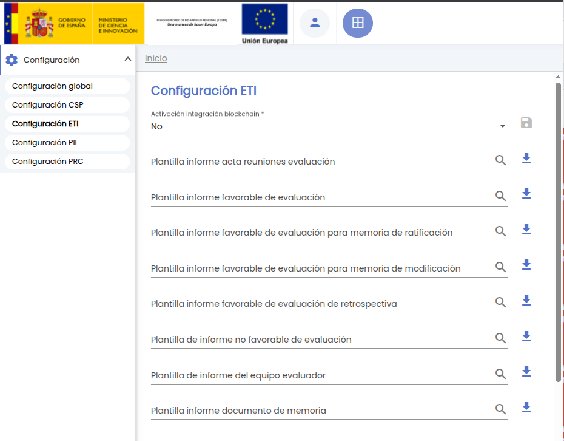
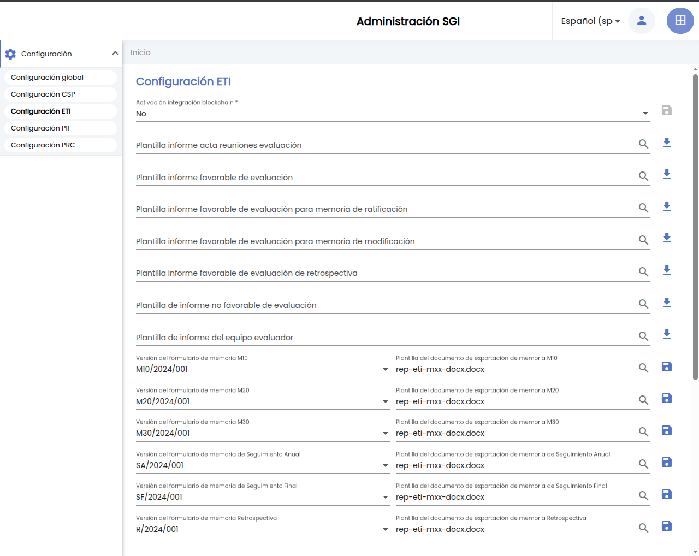

# Guía de Actualización

Esta guía describe los pasos necesarios para actualizar la aplicación a la nueva versión con soporte multi-idioma.

## Índice

- [1. Flujo recomendado de actualización](#1-flujo-de-actualizaci%C3%B3n)
- [2. Cambios en el modelo de datos para dar soporte multi-idioma ](#2-cambios-en-el-modelo-de-datos-para-dar-soporte-multi-idioma )
- [3. Servicios que necesitan revisión manual](#3-servicios-que-necesitan-revisión-manual)
- [4. Integraciones y APIs](#4-integraciones-y-apis)
- [5. Consumo de APIs del SGI y/o consultas directas sobre las bases de datos del SGI](#5-consumo-de-apis-del-sgi-yo-consultas-directas-sobre-las-bases-de-datos-del-sgi)


## 1. Flujo recomendado de actualización

1. **Revisar los cambios en las integraciones**
    - Identificar los [servicios de integración afectados](#7-integraciones-y-apis).
    - Identificar los usos mediante API del `SGI` realizados para la integración con otras aplicaciones.
    - Identificar los usos directos de los esquemas de datos del `SGI`.
    - Aplicar las adaptaciones necesarias para garantizar la compatibilidad con la versión multi-idioma.
2. **Backup inicial**
    - Exportar bases de datos de los servicios del `SGI`.
3. **Exporar los datos que es necesario revisar y/o adaptar en la actualización**
    - Plantilla de formulario de memoria.
    - Las tablas `config` y `resources` de `CNF`.
    - Las tablas `content_tpl` y `subject_tpl` de `COM`.
4. **Realizar la actualización**
    - Desplegar la nueva versión para que se apliquen los cambios.
    - Verificar que el proceso se completa y que todos los servicios arrancan sin errores.
5. **Verificaciones manuales**
    - Comprobar diferencias entre valores actuales y por defecto (ver secciones de cada servicio).
    - Verificar que las configuraciones son correctas.
    - Validar que la aplicación funciona correctamente.

## 2. Cambios en el modelo de datos para dar soporte multi-idioma 
La implementación del soporte multiidioma implica una reestructuración significativa del modelo de datos. Los campos que requieren internacionalización han sido extraídos de las tablas originales y trasladados a tablas específicas, permitiendo que puedan introducirse en todos los idiomas que se consideren necesarios. Aunque a nivel de base de datos no existe limitación el `SGI` actualmente solo admite los idiomas español, inglés y euskera.

Todas las tablas de internacionalización tienen una estructura base común, y su nombre se compone del nombre de la tabla original seguido del nombre del campo:

| Columna | Tipo | Descripción |
| :-- | :-- | :-- |
| `value_` | VARCHAR/CLOB | Valor del campo en el idioma específico |
| `lang` | VARCHAR(2) | Código del idioma (ISO-639-1) |
| `[tabla_principal]_id` | BIGINT | Clave foránea a la tabla principal |


Las tablas internacionalizadas implementan las siguientes **validaciones**:
1. **Valor obligatorio**: La columna `value_` no puede estar vacía.
    - Si no existe un valor para un idioma, no debe existir la fila correspondiente.
2. **Unicidad por idioma**: Solo puede existir un valor por cada combinación de idioma y referencia.
    - La clave primaria de la tabla es la combinación de los campos `lang` y `[tabla_principal]_id`.
3. **Integridad referencial**: Todas las claves foráneas deben mantener consistencia con sus tablas de origen.

### 2.2. Listado de campos internacionalizados
En esta tabla se listan los campos de texto de la base de datos que han sido internacionalizados. Para cada campo, se muestra el esquema y la tabla internacionalizada, su tipo de dato y longitud máxima, así como la tabla y el nombre original del campo al que hace referencia.

|SCHEMA_NAME|TABLE_NAME                                                  |DATA_TYPE|MAX_LENGTH|ORIGINAL_TABLE_NAME                           |ORIGINAL_TABLE_COLUMN_NAME       |
|-----------|------------------------------------------------------------|---------|----------|----------------------------------------------|---------------------------------|
|CSP_SGI    |ALEGACION_REQUERIMIENTO_OBSERVACIONES                       |VARCHAR2 |2000     |ALEGACION_REQUERIMIENTO                       |OBSERVACIONES                    |
|CSP_SGI    |AREA_TEMATICA_DESCRIPCION                                   |VARCHAR2 |250       |AREA_TEMATICA                                 |DESCRIPCION                      |
|CSP_SGI    |AREA_TEMATICA_NOMBRE                                        |VARCHAR2 |50        |AREA_TEMATICA                                 |NOMBRE                           |
|CSP_SGI    |AUTORIZACION_DATOS_CONVOCATORIA                             |VARCHAR2 |250       |AUTORIZACION                                  |DATOS_CONVOCATORIA               |
|CSP_SGI    |AUTORIZACION_OBSERVACIONES                                  |VARCHAR2 |250       |AUTORIZACION                                  |OBSERVACIONES                    |
|CSP_SGI    |AUTORIZACION_TITULO_PROYECTO                                |VARCHAR2 |250       |AUTORIZACION                                  |TITULO_PROYECTO                  |
|CSP_SGI    |CERTIFICADO_AUTORIZACION_DOCUMENTO_REF                      |VARCHAR2 |250       |CERTIFICADO_AUTORIZACION                      |DOCUMENTO_REF                    |
|CSP_SGI    |CERTIFICADO_AUTORIZACION_NOMBRE                             |VARCHAR2 |250       |CERTIFICADO_AUTORIZACION                      |NOMBRE                           |
|CSP_SGI    |CONCEPTO_GASTO_DESCRIPCION                                  |VARCHAR2 |250       |CONCEPTO_GASTO                                |DESCRIPCION                      |
|CSP_SGI    |CONCEPTO_GASTO_NOMBRE                                       |VARCHAR2 |50        |CONCEPTO_GASTO                                |NOMBRE                           |
|CSP_SGI    |CONTEXTO_PROYECTO_INTERESES                                 |VARCHAR2 |2000     |CONTEXTO_PROYECTO                             |INTERESES                        |
|CSP_SGI    |CONTEXTO_PROYECTO_OBJETIVOS                                 |VARCHAR2 |2000     |CONTEXTO_PROYECTO                             |OBJETIVOS                        |
|CSP_SGI    |CONTEXTO_PROYECTO_RESULTADOS_PREVISTOS                      |VARCHAR2 |2000     |CONTEXTO_PROYECTO                             |RESULTADOS_PREVISTOS             |
|CSP_SGI    |CONVOCATORIA_CONCEPTO_GASTO_CODIGO_EC_OBSERVACIONES         |VARCHAR2 |250       |CONVOCATORIA_CONCEPTO_GASTO_CODIGO_EC         |OBSERVACIONES                    |
|CSP_SGI    |CONVOCATORIA_CONCEPTO_GASTO_OBSERVACIONES                   |VARCHAR2 |250       |CONVOCATORIA_CONCEPTO_GASTO                   |OBSERVACIONES                    |
|CSP_SGI    |CONVOCATORIA_DOCUMENTO_NOMBRE                               |VARCHAR2 |50        |CONVOCATORIA_DOCUMENTO                        |NOMBRE                           |
|CSP_SGI    |CONVOCATORIA_DOCUMENTO_OBSERVACIONES                        |VARCHAR2 |2000     |CONVOCATORIA_DOCUMENTO                        |OBSERVACIONES                    |
|CSP_SGI    |CONVOCATORIA_ENLACE_DESCRIPCION                             |VARCHAR2 |250       |CONVOCATORIA_ENLACE                           |DESCRIPCION                      |
|CSP_SGI    |CONVOCATORIA_FASE_OBSERVACIONES                             |VARCHAR2 |2000     |CONVOCATORIA_FASE                             |OBSERVACIONES                    |
|CSP_SGI    |CONVOCATORIA_HITO_COMENTARIO                                |VARCHAR2 |2000     |CONVOCATORIA_HITO                             |COMENTARIO                       |
|CSP_SGI    |CONVOCATORIA_OBJETO                                         |VARCHAR2 |2000     |CONVOCATORIA                                  |OBJETO                           |
|CSP_SGI    |CONVOCATORIA_OBSERVACIONES                                  |VARCHAR2 |2000     |CONVOCATORIA                                  |OBSERVACIONES                    |
|CSP_SGI    |CONVOCATORIA_PARTIDA_DESCRIPCION                            |VARCHAR2 |50        |CONVOCATORIA_PARTIDA                          |DESCRIPCION                      |
|CSP_SGI    |CONVOCATORIA_PERIODO_JUSTIFICACION_OBSERVACIONES            |VARCHAR2 |2000     |CONVOCATORIA_PERIODO_JUSTIFICACION            |OBSERVACIONES                    |
|CSP_SGI    |CONVOCATORIA_PERIODO_SEGUIMIENTO_CIENTIFICO_OBSERVACIONES   |VARCHAR2 |2000     |CONVOCATORIA_PERIODO_SEGUIMIENTO_CIENTIFICO   |OBSERVACIONES                    |
|CSP_SGI    |CONVOCATORIA_TITULO                                         |VARCHAR2 |1000     |CONVOCATORIA                                  |TITULO                           |
|CSP_SGI    |DOCUMENTO_REQUERIDO_SOLICITUD_OBSERVACIONES                 |VARCHAR2 |250       |DOCUMENTO_REQUERIDO_SOLICITUD                 |OBSERVACIONES                    |
|CSP_SGI    |ESTADO_AUTORIZACION_COMENTARIO                              |VARCHAR2 |250       |ESTADO_AUTORIZACION                           |COMENTARIO                       |
|CSP_SGI    |ESTADO_GASTO_PROYECTO_COMENTARIO                            |VARCHAR2 |2000     |ESTADO_GASTO_PROYECTO                         |COMENTARIO                       |
|CSP_SGI    |ESTADO_PROYECTO_COMENTARIO                                  |VARCHAR2 |2000     |ESTADO_PROYECTO                               |COMENTARIO                       |
|CSP_SGI    |ESTADO_SOLICITUD_COMENTARIO                                 |VARCHAR2 |2000     |ESTADO_SOLICITUD                              |COMENTARIO                       |
|CSP_SGI    |ESTADO_VALIDACION_IP_COMENTARIO                             |VARCHAR2 |1024     |ESTADO_VALIDACION_IP                          |COMENTARIO                       |
|CSP_SGI    |FUENTE_FINANCIACION_DESCRIPCION                             |VARCHAR2 |250       |FUENTE_FINANCIACION                           |DESCRIPCION                      |
|CSP_SGI    |FUENTE_FINANCIACION_NOMBRE                                  |VARCHAR2 |50        |FUENTE_FINANCIACION                           |NOMBRE                           |
|CSP_SGI    |GASTO_PROYECTO_OBSERVACIONES                                |VARCHAR2 |2000     |GASTO_PROYECTO                                |OBSERVACIONES                    |
|CSP_SGI    |GASTO_REQUERIMIENTO_JUSTIFICACION_ALEGACION                 |VARCHAR2 |2000     |GASTO_REQUERIMIENTO_JUSTIFICACION             |ALEGACION                        |
|CSP_SGI    |GASTO_REQUERIMIENTO_JUSTIFICACION_INCIDENCIA                |VARCHAR2 |2000     |GASTO_REQUERIMIENTO_JUSTIFICACION             |INCIDENCIA                       |
|CSP_SGI    |GRUPO_EQUIPO_INSTRUMENTAL_DESCRIPCION                       |VARCHAR2 |250       |GRUPO_EQUIPO_INSTRUMENTAL                     |DESCRIPCION                      |
|CSP_SGI    |GRUPO_EQUIPO_INSTRUMENTAL_NOMBRE                            |VARCHAR2 |100       |GRUPO_EQUIPO_INSTRUMENTAL                     |NOMBRE                           |
|CSP_SGI    |GRUPO_NOMBRE                                                |VARCHAR2 |250       |GRUPO                                         |NOMBRE                           |
|CSP_SGI    |GRUPO_RESUMEN                                               |CLOB     |-         |GRUPO                                         |RESUMEN                          |
|CSP_SGI    |INCIDENCIA_DOCUMENTACION_REQUERIMIENTO_ALEGACION            |VARCHAR2 |2000     |INCIDENCIA_DOCUMENTACION_REQUERIMIENTO        |ALEGACION                        |
|CSP_SGI    |INCIDENCIA_DOCUMENTACION_REQUERIMIENTO_INCIDENCIA           |VARCHAR2 |2000     |INCIDENCIA_DOCUMENTACION_REQUERIMIENTO        |INCIDENCIA                       |
|CSP_SGI    |INCIDENCIA_DOCUMENTACION_REQUERIMIENTO_NOMBRE_DOCUMENTO     |VARCHAR2 |250       |INCIDENCIA_DOCUMENTACION_REQUERIMIENTO        |NOMBRE_DOCUMENTO                 |
|CSP_SGI    |LINEA_INVESTIGACION_NOMBRE                                  |VARCHAR2 |1000     |LINEA_INVESTIGACION                           |NOMBRE                           |
|CSP_SGI    |MODELO_EJECUCION_DESCRIPCION                                |VARCHAR2 |250       |MODELO_EJECUCION                              |DESCRIPCION                      |
|CSP_SGI    |MODELO_EJECUCION_NOMBRE                                     |VARCHAR2 |50        |MODELO_EJECUCION                              |NOMBRE                           |
|CSP_SGI    |NOTIFICACION_PROYECTO_EXTERNO_CVN_TITULO                    |VARCHAR2 |250       |NOTIFICACION_PROYECTO_EXTERNO_CVN             |TITULO                           |
|CSP_SGI    |PROGRAMA_DESCRIPCION                                        |CLOB     |-          |PROGRAMA                                      |DESCRIPCION                      |
|CSP_SGI    |PROGRAMA_NOMBRE                                             |VARCHAR2 |200       |PROGRAMA                                      |NOMBRE                           |
|CSP_SGI    |PRORROGA_DOCUMENTO_COMENTARIO                               |VARCHAR2 |2000     |PRORROGA_DOCUMENTO                            |COMENTARIO                       |
|CSP_SGI    |PRORROGA_DOCUMENTO_NOMBRE                                   |VARCHAR2 |50        |PRORROGA_DOCUMENTO                            |NOMBRE                           |
|CSP_SGI    |PROYECTO_CONCEPTO_GASTO_CODIGO_EC_OBSERVACIONES             |VARCHAR2 |250       |PROYECTO_CONCEPTO_GASTO_CODIGO_EC             |OBSERVACIONES                    |
|CSP_SGI    |PROYECTO_CONCEPTO_GASTO_OBSERVACIONES                       |VARCHAR2 |250       |PROYECTO_CONCEPTO_GASTO                       |OBSERVACIONES                    |
|CSP_SGI    |PROYECTO_DOCUMENTO_COMENTARIO                               |VARCHAR2 |2000     |PROYECTO_DOCUMENTO                            |COMENTARIO                       |
|CSP_SGI    |PROYECTO_DOCUMENTO_NOMBRE                                   |VARCHAR2 |250       |PROYECTO_DOCUMENTO                            |NOMBRE                           |
|CSP_SGI    |PROYECTO_FACTURACION_COMENTARIO                             |VARCHAR2 |1024     |PROYECTO_FACTURACION                          |COMENTARIO                       |
|CSP_SGI    |PROYECTO_FASE_OBSERVACIONES                                 |VARCHAR2 |2000     |PROYECTO                                      |FASE_OBSERVACIONES               |
|CSP_SGI    |PROYECTO_HITO_COMENTARIO                                    |VARCHAR2 |2000     |PROYECTO_HITO                                 |COMENTARIO                       |
|CSP_SGI    |PROYECTO_OBSERVACIONES                                      |VARCHAR2 |2000     |PROYECTO                                      |OBSERVACIONES                    |
|CSP_SGI    |PROYECTO_PAQUETE_TRABAJO_DESCRIPCION                        |VARCHAR2 |2000     |PROYECTO                                      |PAQUETE_TRABAJO_DESCRIPCION      |
|CSP_SGI    |PROYECTO_PARTIDA_DESCRIPCION                                |VARCHAR2 |250       |PROYECTO_PARTIDA                              |DESCRIPCION                      |
|CSP_SGI    |PROYECTO_PERIODO_JUSTIFICACION_OBSERVACIONES                |VARCHAR2 |2000     |PROYECTO_PERIODO_JUSTIFICACION                |OBSERVACIONES                    |
|CSP_SGI    |PROYECTO_PERIODO_SEGUIMIENTO_DOCUMENTO_COMENTARIO           |VARCHAR2 |2000     |PROYECTO_PERIODO_SEGUIMIENTO_DOCUMENTO        |COMENTARIO                       |
|CSP_SGI    |PROYECTO_PERIODO_SEGUIMIENTO_DOCUMENTO_NOMBRE               |VARCHAR2 |50        |PROYECTO_PERIODO_SEGUIMIENTO_DOCUMENTO        |NOMBRE                           |
|CSP_SGI    |PROYECTO_PERIODO_SEGUIMIENTO_OBSERVACIONES                  |VARCHAR2 |2000     |PROYECTO_PERIODO_SEGUIMIENTO                  |OBSERVACIONES                    |
|CSP_SGI    |PROYECTO_PRORROGA_OBSERVACIONES                             |VARCHAR2 |2000     |PROYECTO_PRORROGA                             |OBSERVACIONES                    |
|CSP_SGI    |PROYECTO_SOCIO_PERIODO_JUSTIFICACION_DOCUMENTO_COMENTARIO   |VARCHAR2 |2000     |PROYECTO_SOCIO_PERIODO_JUSTIFICACION_DOCUMENTO|COMENTARIO                       |
|CSP_SGI    |PROYECTO_SOCIO_PERIODO_JUSTIFICACION_DOCUMENTO_NOMBRE       |VARCHAR2 |250       |PROYECTO_SOCIO_PERIODO_JUSTIFICACION_DOCUMENTO|NOMBRE                           |
|CSP_SGI    |PROYECTO_SOCIO_PERIODO_JUSTIFICACION_OBSERVACIONES          |VARCHAR2 |2000     |PROYECTO_SOCIO_PERIODO_JUSTIFICACION          |OBSERVACIONES                    |
|CSP_SGI    |PROYECTO_TITULO                                             |VARCHAR2 |250       |PROYECTO                                      |TITULO                           |
|CSP_SGI    |REQUERIMIENTO_JUSTIFICACION_OBSERVACIONES                   |VARCHAR2 |2000     |REQUERIMIENTO_JUSTIFICACION                   |OBSERVACIONES                    |
|CSP_SGI    |REQUISITO_EQUIPO_OTROS_REQUISITOS                           |VARCHAR2 |2000     |REQUISITOEQUIPO                               |REQUISITO_EQUIPO_OTROS_REQUISITOS|
|CSP_SGI    |REQUISITO_IP_OTROS_REQUISITOS                               |VARCHAR2 |2000     |REQUISITOIP                                   |REQUISITO_IP_OTROS_REQUISITOS    |
|CSP_SGI    |ROL_PROYECTO_ABREVIATURA                                    |VARCHAR2 |5         |ROL_PROYECTO                                  |ABREVIATURA                      |
|CSP_SGI    |ROL_PROYECTO_DESCRIPCION                                    |VARCHAR2 |250       |ROL_PROYECTO                                  |DESCRIPCION                      |
|CSP_SGI    |ROL_PROYECTO_NOMBRE                                         |VARCHAR2 |50        |ROL_PROYECTO                                  |NOMBRE                           |
|CSP_SGI    |ROL_SOCIO_ABREVIATURA                                       |VARCHAR2 |5         |ROL_SOCIO                                     |ABREVIATURA                      |
|CSP_SGI    |ROL_SOCIO_DESCRIPCION                                       |VARCHAR2 |250       |ROL_SOCIO                                     |DESCRIPCION                      |
|CSP_SGI    |ROL_SOCIO_NOMBRE                                            |VARCHAR2 |50        |ROL_SOCIO                                     |NOMBRE                           |
|CSP_SGI    |SOLICITUD_DOCUMENTO_COMENTARIO                              |VARCHAR2 |2000     |SOLICITUD_DOCUMENTO                           |COMENTARIO                       |
|CSP_SGI    |SOLICITUD_DOCUMENTO_NOMBRE                                  |VARCHAR2 |50        |SOLICITUD_DOCUMENTO                           |NOMBRE                           |
|CSP_SGI    |SOLICITUD_HITO_COMENTARIO                                   |VARCHAR2 |2000     |SOLICITUD_HITO                                |COMENTARIO                       |
|CSP_SGI    |SOLICITUD_OBSERVACIONES                                     |VARCHAR2 |2000     |SOLICITUD                                     |OBSERVACIONES                    |
|CSP_SGI    |SOLICITUD_PROYECTO_INTERESES                                |VARCHAR2 |2000     |SOLICITUD_PROYECTO                            |INTERESES                        |
|CSP_SGI    |SOLICITUD_PROYECTO_OBJETIVOS                                |VARCHAR2 |2000     |SOLICITUD_PROYECTO                            |OBJETIVOS                        |
|CSP_SGI    |SOLICITUD_PROYECTO_PRESUPUESTO_OBSERVACIONES                |VARCHAR2 |2000     |SOLICITUD_PROYECTO_PRESUPUESTO                |OBSERVACIONES                    |
|CSP_SGI    |SOLICITUD_PROYECTO_RESULTADOS_PREVISTOS                     |VARCHAR2 |2000     |SOLICITUD_PROYECTO                            |RESULTADOS_PREVISTOS             |
|CSP_SGI    |SOLICITUD_PROYECTO_SOCIO_PERIODO_JUSTIFICACION_OBSERVACIONES|VARCHAR2 |2000     |SOLICITUD_PROYECTO_SOCIO_PERIODO_JUSTIFICACION|OBSERVACIONES                    |
|CSP_SGI    |SOLICITUD_RRHH_OBSERVACIONES                                |CLOB     |-          |SOLICITUD_RRHH                                |OBSERVACIONES                    |
|CSP_SGI    |SOLICITUD_RRHH_RESUMEN                                      |CLOB     |-          |SOLICITUD_RRHH                                |RESUMEN                          |
|CSP_SGI    |SOLICITUD_RRHH_TITULO_TRABAJO                               |VARCHAR2 |1000     |SOLICITUD_RRHH                                |TITULO_TRABAJO                   |
|CSP_SGI    |SOLICITUD_TITULO                                            |VARCHAR2 |250       |SOLICITUD                                     |TITULO                           |
|CSP_SGI    |TIPO_AMBITO_GEOGRAFICO_NOMBRE                               |VARCHAR2 |50        |TIPO_AMBITO_GEOGRAFICO                        |NOMBRE                           |
|CSP_SGI    |TIPO_DOCUMENTO_DESCRIPCION                                  |VARCHAR2 |250       |TIPO_DOCUMENTO                                |DESCRIPCION                      |
|CSP_SGI    |TIPO_DOCUMENTO_NOMBRE                                       |VARCHAR2 |50        |TIPO_DOCUMENTO                                |NOMBRE                           |
|CSP_SGI    |TIPO_ENLACE_DESCRIPCION                                     |VARCHAR2 |250       |TIPO_ENLACE                                   |DESCRIPCION                      |
|CSP_SGI    |TIPO_ENLACE_NOMBRE                                          |VARCHAR2 |50        |TIPO_ENLACE                                   |NOMBRE                           |
|CSP_SGI    |TIPO_FACTURACION_NOMBRE                                     |VARCHAR2 |50        |TIPO_FACTURACION                              |NOMBRE                           |
|CSP_SGI    |TIPO_FASE_DESCRIPCION                                       |VARCHAR2 |250       |TIPO_FASE                                     |DESCRIPCION                      |
|CSP_SGI    |TIPO_FASE_NOMBRE                                            |VARCHAR2 |50        |TIPO_FASE                                     |NOMBRE                           |
|CSP_SGI    |TIPO_FINALIDAD_DESCRIPCION                                  |VARCHAR2 |250       |TIPO_FINALIDAD                                |DESCRIPCION                      |
|CSP_SGI    |TIPO_FINALIDAD_NOMBRE                                       |VARCHAR2 |100       |TIPO_FINALIDAD                                |NOMBRE                           |
|CSP_SGI    |TIPO_FINANCIACION_DESCRIPCION                               |VARCHAR2 |250       |TIPO_FINANCIACION                             |DESCRIPCION                      |
|CSP_SGI    |TIPO_FINANCIACION_NOMBRE                                    |VARCHAR2 |50        |TIPO_FINANCIACION                             |NOMBRE                           |
|CSP_SGI    |TIPO_HITO_DESCRIPCION                                       |VARCHAR2 |250       |TIPO_HITO                                     |DESCRIPCION                      |
|CSP_SGI    |TIPO_HITO_NOMBRE                                            |VARCHAR2 |50        |TIPO_HITO                                     |NOMBRE                           |
|CSP_SGI    |TIPO_ORIGEN_FUENTE_FINANCIACION_NOMBRE                      |VARCHAR2 |50        |TIPO_ORIGEN_FUENTE_FINANCIACION               |NOMBRE                           |
|CSP_SGI    |TIPO_REGIMEN_CONCURRENCIA_NOMBRE                            |VARCHAR2 |50        |TIPO_REGIMEN_CONCURRENCIA                     |NOMBRE                           |
|CSP_SGI    |TIPO_REQUERIMIENTO_NOMBRE                                   |VARCHAR2 |2000     |TIPO_REQUERIMIENTO                            |NOMBRE                           |
|EER_SGI    |EMPRESA_CONOCIMIENTO_TECNOLOGIA                             |VARCHAR2 |1000     |EMPRESA                                       |CONOCIMIENTO_TECNOLOGIA          |
|EER_SGI    |EMPRESA_DOCUMENTO_COMENTARIOS                               |VARCHAR2 |2000     |EMPRESA_DOCUMENTO                             |COMENTARIOS                      |
|EER_SGI    |EMPRESA_DOCUMENTO_NOMBRE                                    |VARCHAR2 |250       |EMPRESA_DOCUMENTO                             |NOMBRE                           |
|EER_SGI    |EMPRESA_NOMBRE_RAZON_SOCIAL                                 |VARCHAR2 |50        |EMPRESA                                       |NOMBRE_RAZON_SOCIAL              |
|EER_SGI    |EMPRESA_NOTARIO                                             |VARCHAR2 |250       |EMPRESA                                       |NOTARIO                          |
|EER_SGI    |EMPRESA_OBJETO_SOCIAL                                       |VARCHAR2 |1000     |EMPRESA                                       |OBJETO_SOCIAL                    |
|EER_SGI    |EMPRESA_OBSERVACIONES                                       |VARCHAR2 |2000     |EMPRESA                                       |OBSERVACIONES                    |
|EER_SGI    |TIPO_DOCUMENTO_DESCRIPCION                                  |VARCHAR2 |250       |TIPO_DOCUMENTO                                |DESCRIPCION                      |
|EER_SGI    |TIPO_DOCUMENTO_NOMBRE                                       |VARCHAR2 |250       |TIPO_DOCUMENTO                                |NOMBRE                           |
|ETI_SGI    |ACTA_RESUMEN                                                |CLOB     |-          |ACTA                                          |RESUMEN                          |
|ETI_SGI    |ASISTENTES_MOTIVO                                           |VARCHAR2 |250       |ASISTENTES                                    |MOTIVO                           |
|ETI_SGI    |BLOQUE_NOMBRE                                               |VARCHAR2 |2000     |BLOQUE                                        |NOMBRE                           |
|ETI_SGI    |COMENTARIO_TEXTO                                            |VARCHAR2 |2000     |COMENTARIO                                    |TEXTO                            |
|ETI_SGI    |COMITE_NOMBRE                                               |VARCHAR2 |250       |COMITE                                        |NOMBRE                           |
|ETI_SGI    |CONVOCATORIA_REUNION_LUGAR                                  |VARCHAR2 |250       |CONVOCATORIA_REUNION                          |LUGAR                            |
|ETI_SGI    |CONVOCATORIA_REUNION_ORDEN_DIA                              |VARCHAR2 |2000     |CONVOCATORIA_REUNION                          |ORDEN_DIA                        |
|ETI_SGI    |DOCUMENTACION_CONVOCATORIA_REUNION_NOMBRE                   |VARCHAR2 |250       |DOCUMENTACION_CONVOCATORIA_REUNION            |NOMBRE                           |
|ETI_SGI    |DOCUMENTACION_MEMORIA_NOMBRE                                |VARCHAR2 |250       |DOCUMENTACION_MEMORIA                         |NOMBRE                           |
|ETI_SGI    |ESTADO_MEMORIA_COMENTARIO                                   |VARCHAR2 |2000     |ESTADO_MEMORIA                                |COMENTARIO                       |
|ETI_SGI    |EVALUACION_COMENTARIO                                       |VARCHAR2 |2000     |EVALUACION                                    |COMENTARIO                       |
|ETI_SGI    |EVALUADOR_RESUMEN                                           |CLOB     |-          |EVALUADOR                                     |RESUMEN                          |
|ETI_SGI    |FORMACION_ESPECIFICA_NOMBRE                                 |VARCHAR2 |250       |FORMACION_ESPECIFICA                          |NOMBRE                           |
|ETI_SGI    |FORMULARIO_REPORT                                           |BLOB     |-         |FORMULARIO                                    |REPORT                           |
|ETI_SGI    |MEMORIA_TITULO                                              |VARCHAR2 |2000     |MEMORIA                                       |TITULO                           |
|ETI_SGI    |PETICION_EVALUACION_DISMETODOLOGICO                         |CLOB     |-          |PETICION_EVALUACION                           |DISMETODOLOGICO                  |
|ETI_SGI    |PETICION_EVALUACION_FUENTE_FINANCIACION                     |VARCHAR2 |250       |PETICION_EVALUACION                           |FUENTE_FINANCIACION              |
|ETI_SGI    |PETICION_EVALUACION_OBJETIVOS                               |CLOB     |-          |PETICION_EVALUACION                           |OBJETIVOS                        |
|ETI_SGI    |PETICION_EVALUACION_OTROVALORSOCIAL                         |VARCHAR2 |2000     |PETICION_EVALUACION                           |OTROVALORSOCIAL                  |
|ETI_SGI    |PETICION_EVALUACION_RESUMEN                                 |CLOB     |-          |PETICION_EVALUACION                           |RESUMEN                          |
|ETI_SGI    |PETICION_EVALUACION_TITULO                                  |VARCHAR2 |1000     |PETICION_EVALUACION                           |TITULO                           |
|ETI_SGI    |TAREA_FORMACION                                             |VARCHAR2 |250       |TAREA                                         |FORMACION                        |
|ETI_SGI    |TAREA_NOMBRE                                                |VARCHAR2 |250       |TAREA                                         |NOMBRE                           |
|ETI_SGI    |TAREA_ORGANISMO                                             |VARCHAR2 |250       |TAREA                                         |ORGANISMO                        |
|ETI_SGI    |TIPO_DOCUMENTO_NOMBRE                                       |VARCHAR2 |250       |TIPO_DOCUMENTO                                |NOMBRE                           |
|ETI_SGI    |TIPO_TAREA_NOMBRE                                           |VARCHAR2 |250       |TIPO_TAREA                                    |NOMBRE                           |
|PII_SGI    |INFORME_PATENTABILIDAD_COMENTARIOS                          |VARCHAR2 |250       |INFORME_PATENTABILIDAD                        |COMENTARIOS                      |
|PII_SGI    |INFORME_PATENTABILIDAD_NOMBRE                               |VARCHAR2 |50        |INFORME_PATENTABILIDAD                        |NOMBRE                           |
|PII_SGI    |INVENCION_COMENTARIOS                                       |VARCHAR2 |2000     |INVENCION                                     |COMENTARIOS                      |
|PII_SGI    |INVENCION_DESCRIPCION                                       |VARCHAR2 |2000     |INVENCION                                     |DESCRIPCION                      |
|PII_SGI    |INVENCION_DOCUMENTO_NOMBRE                                  |VARCHAR2 |250       |INVENCION_DOCUMENTO                           |NOMBRE                           |
|PII_SGI    |INVENCION_TITULO                                            |VARCHAR2 |250       |INVENCION                                     |TITULO                           |
|PII_SGI    |PROCEDIMIENTO_ACCION_A_TOMAR                                |VARCHAR2 |500       |PROCEDIMIENTO                                 |ACCION_A_TOMAR                   |
|PII_SGI    |PROCEDIMIENTO_COMENTARIOS                                   |VARCHAR2 |2000     |PROCEDIMIENTO                                 |COMENTARIOS                      |
|PII_SGI    |PROCEDIMIENTO_DOCUMENTO_NOMBRE                              |VARCHAR2 |250       |PROCEDIMIENTO_DOCUMENTO                       |NOMBRE                           |
|PII_SGI    |RESULTADO_INFORME_PATENTABILIDAD_DESCRIPCION                |VARCHAR2 |250       |RESULTADO_INFORME_PATENTABILIDAD              |DESCRIPCION                      |
|PII_SGI    |RESULTADO_INFORME_PATENTABILIDAD_NOMBRE                     |VARCHAR2 |50        |RESULTADO_INFORME_PATENTABILIDAD              |NOMBRE                           |
|PII_SGI    |SECTOR_APLICACION_DESCRIPCION                               |VARCHAR2 |250       |SECTOR_APLICACION                             |DESCRIPCION                      |
|PII_SGI    |SECTOR_APLICACION_NOMBRE                                    |VARCHAR2 |50        |SECTOR_APLICACION                             |NOMBRE                           |
|PII_SGI    |SOLICITUD_PROTECCION_COMENTARIOS                            |VARCHAR2 |2000     |SOLICITUD_PROTECCION                          |COMENTARIOS                      |
|PII_SGI    |SOLICITUD_PROTECCION_TITULO                                 |VARCHAR2 |250       |SOLICITUD_PROTECCION                          |TITULO                           |
|PII_SGI    |TIPO_CADUCIDAD_DESCRIPCION                                  |VARCHAR2 |250       |TIPO_CADUCIDAD                                |DESCRIPCION                      |
|PII_SGI    |TIPO_PROCEDIMIENTO_DESCRIPCION                              |VARCHAR2 |250       |TIPO_PROCEDIMIENTO                            |DESCRIPCION                      |
|PII_SGI    |TIPO_PROCEDIMIENTO_NOMBRE                                   |VARCHAR2 |50        |TIPO_PROCEDIMIENTO                            |NOMBRE                           |
|PII_SGI    |TIPO_PROTECCION_DESCRIPCION                                 |VARCHAR2 |250       |TIPO_PROTECCION                               |DESCRIPCION                      |
|PII_SGI    |TIPO_PROTECCION_NOMBRE                                      |VARCHAR2 |50        |TIPO_PROTECCION                               |NOMBRE                           |
|PII_SGI    |VIA_PROTECCION_DESCRIPCION                                  |VARCHAR2 |250       |VIA_PROTECCION                                |DESCRIPCION                      |
|PII_SGI    |VIA_PROTECCION_NOMBRE                                       |VARCHAR2 |50        |VIA_PROTECCION                                |NOMBRE                           |
|REL_SGI    |RELACION_OBSERVACIONES                                      |VARCHAR2 |2000     |RELACION                                      |OBSERVACIONES                    |


## 3. Servicios que necesitan revisión manual
El proceso de actualización automática migra los datos de todas las tablas mencionadas en el punto anterior, asignando los valores actuales al idioma definido en el fichero de despliegue (por defecto, español). Sin embargo, existen datos que no pueden migrarse automáticamente, ya que requieren adaptaciones manuales específicas en cada implantación. Por este motivo, es necesario realizar una revisión que no puede validarse de forma automática.

### 3.1. COM

Para facilitar los procesos de actualización y permitir que las plantillas puedan adaptarse progresivamente a nuevas versiones de la aplicación, sin riesgo de sobrescribir las personalizaciones realizadas en cada implantación, se han añadido columnas específicas para almacenar los valores por defecto del `SGI` en las tablas  en las que se almacenan las plantillas de comunicados.

- Tabla `content_tpl`:
  - `default_tpl_text` (CLOB): Valor por defecto del texto de la plantilla.
  - `default_tpl_html` (CLOB): Valor por defecto del HTML de la plantilla.
- Tabla `subject_tpl`:
  - `default_tpl` (CLOB): Valor por defecto del asunto de la plantilla.


#### 3.1.1. Backup tablas afectadas (Opcional)
Para garantizar la integridad de los datos durante el proceso de actualización y verificar que el procedimiento se haya ejecutado correctamente, se recomienda realizar una copia de seguridad o exportación de las tablas afectadas.

Una opción simple es crear tablas de respaldo temporales, que permitan realizar comparaciones posteriores con las tablas actualizadas para detectar las posibles discrepancias. 

```sql
-- Crear tablas de respaldo temporales
CREATE TABLE content_tpl_backup AS SELECT * FROM content_tpl;
CREATE TABLE subject_tpl_backup AS SELECT * FROM subject_tpl;
```
Si se opta por esta vía, es importante recordar eliminar estas tablas una vez finalizado y validado el proceso de actualización.

#### 3.1.2. Verificación de Diferencias
Las siguientes queries permiten identificar todas las plantillas en las que hay diferencias entre el valor por defecto y el valor actual de la plantilla para facilitar el análisis:

- Oracle:
  ```sql
  -- Verificar content_tpl - Mostrar todos los registros con indicadores de diferencias
  SELECT
        name,
        CASE WHEN DBMS_LOB.COMPARE(tpl_text, default_tpl_text) != 0 THEN 'DIFFERENT' ELSE 'EQUALS' END AS text_comparison,
        CASE WHEN DBMS_LOB.COMPARE(tpl_html, default_tpl_html) != 0 THEN 'DIFFERENT' ELSE 'EQUALS' END AS html_comparison,
        tpl_text AS current_text,
        default_tpl_text AS default_text,
        tpl_html AS current_html,
        default_tpl_html AS default_html
  FROM COM_SGI.content_tpl
  ORDER BY name;

  -- Verificar subject_tpl - Mostrar todos los registros con indicadores de diferencias
  SELECT
        name,
        CASE WHEN DBMS_LOB.COMPARE(tpl, default_tpl) != 0 THEN 'DIFFERENT' ELSE 'EQUALS' END AS template_comparison,
        tpl AS current_template,
        default_tpl AS default_template
  FROM COM_SGI.subject_tpl
  ORDER BY name;
  ```

- PostgreSQL:
  ```sql
  -- Verificar content_tpl - Mostrar todos los registros con indicadores de diferencias
  SELECT
        name,
        CASE WHEN tpl_text != default_tpl_text THEN 'DIFFERENT' ELSE 'EQUALS' END AS text_comparison,
        CASE WHEN tpl_html != default_tpl_html THEN 'DIFFERENT' ELSE 'EQUALS' END AS html_comparison,
        tpl_text AS current_text,
        default_tpl_text AS default_text,
        tpl_html AS current_html,
        default_tpl_html AS default_html
  FROM com.content_tpl
  ORDER BY name;

  -- Verificar subject_tpl - Mostrar todos los registros con indicadores de diferencias
  SELECT
        name,
        CASE WHEN tpl != default_tpl THEN 'DIFFERENT' ELSE 'EQUALS' END AS template_comparison,
        tpl AS current_template,
        default_tpl AS default_template
  FROM com.subject_tpl
  ORDER BY name;
  ```


- SQL Server:
  ```sql
  -- Verificar content_tpl - Mostrar todos los registros con indicadores de diferencias
  SELECT
        name,
        CASE WHEN CAST(tpl_text AS NVARCHAR(MAX)) != CAST(default_tpl_text AS NVARCHAR(MAX)) 
              THEN 'DIFFERENT' ELSE 'EQUALS' END AS text_comparison,
        CASE WHEN CAST(tpl_html AS NVARCHAR(MAX)) != CAST(default_tpl_html AS NVARCHAR(MAX)) 
              THEN 'DIFFERENT' ELSE 'EQUALS' END AS html_comparison,
        CAST(tpl_text AS NVARCHAR(MAX)) AS current_text,
        CAST(default_tpl_text AS NVARCHAR(MAX)) AS default_text,
        CAST(tpl_html AS NVARCHAR(MAX)) AS current_html,
        CAST(default_tpl_html AS NVARCHAR(MAX)) AS default_html
  FROM COM_SGI.content_tpl
  ORDER BY name;

  -- Verificar subject_tpl - Mostrar todos los registros con indicadores de diferencias
  SELECT
        name,
        CASE WHEN CAST(tpl AS NVARCHAR(MAX)) != CAST(default_tpl AS NVARCHAR(MAX)) 
              THEN 'DIFFERENT' ELSE 'EQUALS' END AS template_comparison,
        CAST(tpl AS NVARCHAR(MAX)) AS current_template,
        CAST(default_tpl AS NVARCHAR(MAX)) AS default_template
  FROM COM_SGI.subject_tpl
  ORDER BY name;
  ```

#### 3.1.3. Interpretación de los resultados
Las queries anteriores proporcionan:
- **Columnas de comparación**: Indican si existen diferencias entre valores actuales y los valores por defecto
- **Columnas de valores actuales**: Muestran el contenido personalizado existente
- **Columnas de valores por defecto**: Muestran los nuevos valores base de la versión

Los registros marcados como **'DIFFERENT'** requieren revisión manual para preservar las personalizaciones mientras se adoptan las mejoras de la nueva versión.

#### 3.1.4. Proceso de Actualización Manual
Para las plantillas que **difieren** de los valores por defecto:
1. **Analizar** las diferencias identificadas.
2. **Comparar** con los valores de la versión anterior ([Ver plantillas versión anterior](/sgi-com-service/src/main/resources/db/changelog/changes/0.5.0/clob/old)) si se considera necesario para identificar los cambios entre las versiones personalizadas y la versión por defecto previa.
3. **Identificar** las personalizaciones que hay que realizar sobre las nuevas plantillas por defecto.
4. **Aplicar** las personalizaciones usando como base las nuevas plantillas por defecto.


#### 3.1.5. Ejemplo de actualización de una plantilla
Tomando como ejemplo la plantilla por defecto en formato texto de **CSP_COM_INICIO_PRESENTACION_SEGUIMIENTO_CIENTIFICO_CONTENT** de la versión anterior:

```ftl
<#assign data = CSP_COM_INICIO_PRESENTACION_SEGUIMIENTO_CIENTIFICO_DATA?eval />
<#--
  Formato CSP_COM_INICIO_PRESENTACION_SEGUIMIENTO_CIENTIFICO_DATA:
  { 
    "fecha": "2022-01-01",
    "proyectos" : [
      {
        "titulo": "Proyecto 1",
        "fechaInicio": "2022-01-01T00:00:00Z",
        "fechaFin": "2022-01-31T23:59:59Z"
      },
      {
        "titulo": "Proyecto 2",
        "fechaInicio": "2022-01-01T00:00:00Z",
        "fechaFin": "2022-01-31T23:59:59Z"
      }
    ]
  }
-->
En el mes de ${data.fecha?date.iso?string.MMMM} de ${data.fecha?date.iso?string.yyyy} se inicia el período de presentación de la justificación del seguimiento científico de los siguientes proyectos:

<#list data.proyectos as proyecto> 
* ${proyecto.titulo}
  * Primer día para la presentación de la documentación de justificación ${proyecto.fechaInicio?datetime.iso?string.medium}
  <#if proyecto.fechaFin??>
  * Último día para la presentación de la documentación de justificación ${proyecto.fechaFin?datetime.iso?string.medium}
  </#if>

</#list>
```
Y la plantilla actualizada en la versión multi idioma:

```ftl
<#assign data = CSP_COM_INICIO_PRESENTACION_SEGUIMIENTO_CIENTIFICO_DATA?eval />
<#--
  Formato CSP_COM_INICIO_PRESENTACION_SEGUIMIENTO_CIENTIFICO_DATA:
  { 
    "enlaceAplicacion": "http://sgi.treelogic.com",
    "fecha": "2022-01-01",
    "proyectos" : [
      {
        "titulo": "[{"lang":"es", "value":"Proyecto 1"}]",
        "fechaInicio": "2022-01-01T00:00:00Z",
        "fechaFin": "2022-01-31T23:59:59Z"
      },
      {
        "titulo": "[{"lang":"es", "value":"Proyecto 2"}]",
        "fechaInicio": "2022-01-01T00:00:00Z",
        "fechaFin": "2022-01-31T23:59:59Z"
      }
    ]
  }
-->
<#macro renderEs>
<#setting locale="es">
Le informamos de que proximamente se inician los períodos de presentación de la justificación para el seguimiento científico de los proyectos abajo indicados. Los periodos de presentación de la documentación de justificación son los siguientes:

<#list data.proyectos as proyecto> 
- Proyecto: ${sgi.getFieldValue(proyecto.titulo)}
- Inicio del periodo de presentación de justificación: ${sgi.formatDate(proyecto.fechaInicio, "SHORT")}, ${sgi.formatTime(proyecto.fechaInicio, "SHORT")}
- Fin del periodo de presentación de justificación: <#if proyecto.fechaFin??>${sgi.formatDate(proyecto.fechaFin, "SHORT")}, ${sgi.formatTime(proyecto.fechaFin, "SHORT")}<#else>-</#if>

</#list>
Puede revisar la información a través de la aplicación: ${data.enlaceAplicacion}
</#macro>
<#macro renderEn>
<#setting locale="en">
Please be advised that the submission periods for the justification for the scientific follow-up of the projects listed below will start soon. The periods for submission of justification documents are as follows:

<#list data.proyectos as proyecto> 
- Project: ${sgi.getFieldValue(proyecto.titulo)}
- Start of period for submission of justification: ${sgi.formatDate(proyecto.fechaInicio, "SHORT")}, ${sgi.formatTime(proyecto.fechaInicio, "SHORT")}
- End of period for submission of justification: <#if proyecto.fechaFin??>${sgi.formatDate(proyecto.fechaFin, "SHORT")}, ${sgi.formatTime(proyecto.fechaFin, "SHORT")}<#else>-</#if>

</#list>
You can review the information through the application: ${data.enlaceAplicacion}
</#macro>
<#macro renderEu>
<#setting locale="eu">
Honen bidez jakinarazten dizugu laster hasiko dela behean aipatutako proiektuen jarraipen zientifikorako justifikazioa aurkezteko epea. Honako hauek dira justifikazio dokumentuak aurkezteko epeak:

<#list data.proyectos as proyecto> 
- Proiektua: ${sgi.getFieldValue(proyecto.titulo)}
- Justifikazioa aurkezteko epearen hasiera: ${sgi.formatDate(proyecto.fechaInicio, "SHORT")}, ${sgi.formatTime(proyecto.fechaInicio, "SHORT")}
- Justifikazioa aurkezteko epearen amaiera: <#if proyecto.fechaFin??>${sgi.formatDate(proyecto.fechaFin, "SHORT")}, ${sgi.formatTime(proyecto.fechaFin, "SHORT")}<#else>-</#if>

</#list>
Informazioa berrikus dezakezu aplikazioaren bidez: ${data.enlaceAplicacion}
</#macro>
<#list languagePriorities as renderLang>
<@.vars["render${renderLang?capitalize}"] />
<#if renderLang?has_next>

-------------------------------------------------------------------------------

</#if>
</#list>
```
La forma recomendada para realizar los cambios es utilizar como base la nueva plantilla por defecto y aplicar sobre esta los ajustes necesarios. Esto permite conservar todos los elementos requeridos para el correcto procesamiento de los valores dependientes del idioma. Es fundamental prestar especial atención a las variables utilizadas, verificando si siguen existiendo y si es necesario utilizar alguna función específica para obtener el valor correspondiente al idioma en el que se desea mostrar

Por ejemplo, si se desea que la nueva plantilla muestre contenido solo en español, se deben eliminar los bloques correspondientes al resto de idiomas (```<#macro renderEn>...</#macro>``` y ```<#macro renderEu>...</#macro>```).

Asimismo, como parte del ejemplo para conservar el texto específico de cada proyecto, se deben reemplazar los textos nuevos por los que se desea mantener, teniendo en cuenta que:
- Las variables disponibles en la plantilla pueden haber cambiado.
- Las variables que contienen valores dependientes del idioma (como textos internacionalizados o fechas) no deben usarse directamente.

En su lugar, se deben emplear las funciones apropiadas para obtener el valor en el idioma correcto:
- ```${sgi.getFieldValue(...)}```
- ```${sgi.formatDate(...)}```
- ```${sgi.formatTime(...)}```

El resultado de aplicar estos cambios seria el siguiente:

```ftl
<#assign data = CSP_COM_INICIO_PRESENTACION_SEGUIMIENTO_CIENTIFICO_DATA?eval />
<#--
  Formato CSP_COM_INICIO_PRESENTACION_SEGUIMIENTO_CIENTIFICO_DATA:
  { 
    "enlaceAplicacion": "http://sgi.treelogic.com",
    "fecha": "2022-01-01",
    "proyectos" : [
      {
        "titulo": "[{"lang":"es", "value":"Proyecto 1"}]",
        "fechaInicio": "2022-01-01T00:00:00Z",
        "fechaFin": "2022-01-31T23:59:59Z"
      },
      {
        "titulo": "[{"lang":"es", "value":"Proyecto 2"}]",
        "fechaInicio": "2022-01-01T00:00:00Z",
        "fechaFin": "2022-01-31T23:59:59Z"
      }
    ]
  }
-->
<#macro renderEs>
<#setting locale="es">
Le informamos de que proximamente se inician los períodos de presentación de la justificación para el seguimiento científico de los proyectos abajo indicados. Los periodos de presentación de la documentación de justificación son los siguientes:

<#list data.proyectos as proyecto> 
* ${sgi.getFieldValue(proyecto.titulo)}
  * Primer día para la presentación de la documentación de justificación ${sgi.formatDate(proyecto.fechaInicio, "SHORT")}, ${sgi.formatTime(proyecto.fechaInicio, "SHORT")}
  <#if proyecto.fechaFin??>
  * Último día para la presentación de la documentación de justificación ${sgi.formatDate(proyecto.fechaFin, "SHORT")}, ${sgi.formatTime(proyecto.fechaFin, "SHORT")}
  </#if>

</#list>
Puede revisar la información a través de la aplicación: ${data.enlaceAplicacion}
</#macro>
<#list languagePriorities as renderLang>
<@.vars["render${renderLang?capitalize}"] />
<#if renderLang?has_next>

-------------------------------------------------------------------------------

</#if>
</#list>
```

### 3.2. CNF
La adaptación a la versión multi-idioma no afecta directamente al servicio `CNF`, pero sí se han producido cambios en las variables de configuración almacenadas en las tablas `resources` y `config`. 

Por ello, es recomendable realizar una copia de seguridad o exportación previa de estas tablas, con el fin de:
- Validar que los valores configurados previamente no hayan sido sobreescritos.
- Identificar variables que hayan sido sustituidas por otras o nuevas variables que requieran configuración.

Una forma de comprobar las diferencias es mediante una consulta SQL como la siguiente, que compara los valores actuales con una copia de respaldo:

```sql
SELECT 
  NVL(c.name, b.name) AS name,
  c.value             AS current_value,
  b.value             AS backup_value,
  c.default_value     AS current_default_value,
  b.default_value     AS backup_default_value,
  CASE
    WHEN c.name IS NULL THEN 'Only in backup'
    WHEN b.name IS NULL THEN 'Only in current'
    WHEN dbms_lob.compare(c.value, b.value) != 0
      THEN 'Different'
    ELSE 'Same'
  END AS status
FROM cnf_sgi.config c
FULL OUTER JOIN cnf_sgi.config_backup b ON c.name = b.name;
```

También se puede realizar esta revisión de forma manual desde el módulo de `Administración` de la propia aplicación, verificando que los valores actuales sean correctos.

El parámetro `rep-eti-mxx-docx` de la tabla `resources`, que se ha migrado a la tabla `formulario_report` del servicio de `ETI`, no se ha eliminado automáticamente durante el proceso de actualización para evitar la posible pérdida de las plantillas de los informes. Sin embargo, se recomienda eliminarlo una vez finalizado dicho proceso, con el fin de no mantener variables en desuso.

### 3.3. ETI

#### 3.3.1. Actualización formularios memoria

Como parte de esta nueva versión, se ha incorporado la posibilidad de gestionar diferentes versiones de los formularios de memoria. Esto permite actualizar los formularios sin afectar a las memorias ya creadas o finalizadas, evitando así posibles inconsistencias en los datos.

Ahora, en la tabla `comite` se incluyen referencias a los formularios que deben utilizarse para las nuevas memorias vinculadas a cada comité. Una vez que se crea una `memoria`, se le asignan los formularios vigentes en ese momento, de modo que si posteriormente se cambia la versión del formulario asociada al comité, las memorias ya creadas no se ven afectadas.



Los formularios correspondientes a la nueva versión multi-idioma no son compatibles con los anteriores, por lo que se han incorporado como una nueva versión. Además, se ha actualizado la configuración de los **comités** para que utilicen la versión multi-idioma por defecto.

Opciones de adaptación según el soporte de idiomas requerido:
- **Si no se va a dar soporte a múltiples idiomas**, el comportamiento seguirá siendo el mismo que en versiones anteriores (es decir, con soporte para un único idioma).
En este caso, se puede posponer o descartar la adaptación multi-idioma, y basta con actualizar las referencias en la tabla `comite` a los formularios anteriores `M10/2024/001, M20/2024/001, ..., R/2024/001`.
- **Si se requiere soporte multi-idioma**, el proceso de adaptación es más complejo.
Será necesario crear una nueva versión de cada formulario, o bien modificar la nueva versión por defecto que se incluye en esta actualización.
En ambos casos, la versión previa de los formularios debe mantenerse sin modificar, para garantizar que las memorias existentes puedan seguir su ciclo de vida normalmente.

Crear una nueva versión de los formularios implica, además de su creación en la tabla `formulario` y su asignación en la tabla `comite`, definir toda la estructura asociada, que está distribuida en las tablas `bloque`, `apartado` y `apartado_definicion`. Asimismo, es necesario generar las plantillas de los informes de memoria adaptadas a los nuevos formularios, las cuales se almacenan en la tabla `formulario_report`.


#### 3.3.2. Actualización plantillas formularios memoria
Como consecuencia de los cambios realizados para dar soporte al versionado de formularios, las plantillas que anteriormente se almacenaban en la tabla `resources` del servicio `CNF` se han trasladado a la tabla `formulario_report` del servicio `ETI`. Además, para permitir que cada versión de formulario tenga su propia plantilla, se ha separado el contenido en diferentes ficheros, de forma que cada formulario pueda disponer de su plantilla independiente.

Debido a este cambio de ubicación, **es necesario descargar manualmente la plantilla actual de los formularios de memoria antes de realizar la actualización**.

La descarga puede realizarse desde el apartado **Configuración ETI** del módulo de **Administración**, haciendo clic en el botón correspondiente al campo **Plantilla informe documento de memoria**.



Al igual que ocurre con la actualización de la tabla `comite`, existen dos enfoques para adaptar las plantillas:
- **Mantener la versión previa de los formularios**: En este caso, no es necesario modificar las plantillas. Aunque ahora se permite dividirlas por informe, se puede reutilizar la plantilla descargada y subirla para la versión inicial de cada uno de los formularios como se muestra en la imagen siguiente. La generación de los documentos continuará funcionando igual que antes.

  

- **Adaptar las plantillas a los nuevos formularios**: Si se realizan cambios en los formularios, será necesario modificar las plantillas para reflejar las nuevas estructuras o contenidos. En este caso, al subir la plantilla, se debe seleccionar la versión correspondiente del formulario a la que aplica la actualización.

## 4. Integraciones y APIs

### 4.1. Endpoints afectados

La implementación del soporte multi-idioma impacta directamente en varios endpoints del API, lo que requiere adaptaciones en los servicios de integración para garantizar la compatibilidad y el correcto funcionamiento del sistema.

| Servicio | Método HTTP | Endpoint | Cambios |
| :-- | :-- | :-- | :-- |
| SGE | POST<br>PUT | /facturas-previstas<br>/facturas-previstas/{id} | `comentario` y `tipoFacturacion` pasan de *string* a **array de objetos multi-idioma**. |
| SGE | GET<br>GET | /ejecucion-economica<br>/ejecucion-economica/columnas | El parámetro reducida debe ser soportado en todos los casos, independientemente del `tipoOperacion`. No es necesario que la respuesta varíe en función de su valor. |
| SGE | POST<br>PUT | /periodos-amortizacion<br>/periodos-amortizacion/{id} | `fuenteFinanciacion` y `tipoFacturacion` pasan de *string* a **array de objetos multi-idioma** |
| SGE | POST<br>PUT | /proyectos/formly<br>/proyectos/formly/{id} | Campos del *formly* afectados si contienen textos internacionalizados. |
| CSP | POST | /notificaciones-proyectos | `titulo` pasa de *string* a **array de objetos multi-idioma** |

### 4.1.1. Ejemplos cambios en los objetos enviados

- Endpoints **facturas-previstas**:
  - Ejemplo versión anterior: 
    ```json
    {
      "proyectoSgeId": "P1",
      "proyectoIdSGI": 1,
      "numeroPrevision": 1,
      "fechaEmision": "2024-03-15",
      "importeBase": 1000,
      "porcentajeIVA": 10,
      "comentario": "Un comentario",
      "tipoFacturacion": "Tipo 1",
      "numeroFactura": "S-29|2021"
    }
    ```
  - Ejemplo versión multi-idioma:  
    ```json
    {
      "proyectoSgeId": "P1",
      "proyectoIdSGI": 1,
      "numeroPrevision": 1,
      "fechaEmision": "2024-03-15",
      "importeBase": 1000,
      "porcentajeIVA": 10,
      "comentario": [
        {
          "lang": "es",
          "value": "Un comentario"
        }
      ],
      "tipoFacturacion": [
        {
          "lang": "es",
          "value": "Tipo 1"
        },
        {
          "lang": "en",
          "value": "Type 1"
        }
      ],
      "numeroFactura": "S-29|2021"
    }
    ```
- Endpoints **periodos-amortizacion**:
  - Ejemplo versión anterior: 
    ```json
    {
      "id": "PA1",
      "proyectoId": "P1",
      "anualidad": "2023",
      "empresaRef": "E1",
      "tipoFinanciacion": {
        "id": "T1",
        "nombre": "Tipo 1"
      },
      "fuenteFinanciacion": {
        "id": "F1",
        "nombre": "Fuente 1"
      },
      "fecha": "2023-04-23",
      "importe": 85000
    }
    ```
  - Ejemplo versión multi-idioma:  
    ```json
    {
      "id": "PA1",
      "proyectoId": "P1",
      "anualidad": "2023",
      "empresaRef": "E1",
      "tipoFinanciacion": {
        "id": "T1",
        "nombre": [
          {
            "lang": "es",
            "value": "Tipo 1"
          }
        ]
      },
      "fuenteFinanciacion": {
        "id": "F1",
        "nombre": [
          {
            "lang": "es",
            "value": "Fuente 1"
          }
        ]
      },
      "fecha": "2023-04-23",
      "importe": 85000
    }
    ```
- Endpoints **proyectos/formly**:
  - Ejemplo versión anterior: 
    ```json
    {
      "proyectoSgiId": 2,
      "titulo": "Título proyecto CGF/OPE2",
      "fechaInicio": "2021-01-31T23:00:00Z",
        "fechaFin": "2023-12-05T22:59:59Z",
      "modeloEjecucion": {
        "id": 1,
        "nombre": "Subvención"
      },
      "tipoFinalidad": {
        "id": 2,
        "nombre": "Ayudas en general (Otros tipos)"
      },
      "importeTotalGastos": 1234,
      "importeTotalIngresos": 5678,
      "porIva": 0,
      "causaExencion": "SUJETO_EXENTO",
      "tipoFondo": "REU",
      "programa": "0000-1111"
    }
    ```
  - Ejemplo versión multi-idioma:  
    ```json
    {
      "titulo": [
        {
          "lang": "es",
          "value": "Título proyecto CGF/OPE2"
        }
      ],
      "proyectoSgiId": 2,
      "fechaInicio": "2021-01-31T23:00:00Z",
      "fechaFin": "2023-12-05T22:59:59Z",
      "numeroDocumentoResponsable": "48734989",
      "modeloEjecucion": {
        "id": 1,
        "nombre": [
          {
            "lang": "es",
            "value": "Subvención"
          }
        ],
        "descripcion": [
          {
            "lang": "es",
            "value": "Subvención"
          }
        ],
        "externo": false,
        "contrato": false,
        "solicitudSinConvocatoria": false,
        "activo": true
      },
      "tipoFinalidad": {
        "id": 2,
        "nombre": [
          {
            "lang": "es",
            "value": "Ayudas en general (Otros tipos)"
          }
        ],
        "descripcion": [
          {
            "lang": "es",
            "value": "Ayudas en general (Otros tipos)"
          }
        ],
        "activo": true
      },
      "importeTotalGastos": 1234,
      "importeTotalIngresos": 5678,
      "porIva": 0,
      "causaExencion": {
        "id": "SUJETO_EXENTO",
        "descripcion": "Sujeto y exento"
      },
      "tipoFondo": "REU",
      "programa":"0000-1111"
    }
    ```
- Endpoint **notificaciones-proyectos**:
  - Ejemplo versión anterior: 
    ```json
    {
      "proyectoCVNId": "1",
      "autorizacionId": 3,  
      "solicitanteRef": "45433107",  
      "titulo": "Proyecto 1 CGF/OPE-1 ES",
      "codExterno": "122-566",
      "fechaInicio": "2021-01-31T23:00:00Z",
      "fechaFin": "2022-12-31T22:59:59Z",
      "ambitoGeografico": "Nacional",
      "gradoContribucion": "Investigador/a",
      "responsableRef": "22932567",
      "datosResponsable": "",
      "entidadParticipacionRef": "",
      "datosEntidadParticipacion": "Nombre de la entidad de participación", 
      "nombrePrograma": "Programa de prueba",
      "importeTotal": 15000.50,
      "porcentajeSubvencion": 99.90,
      "documentoRef": "12-sd5616565-1516sdf-sdf",
      "urlDocumentoAcreditacion": "aaaa.es/aa.s",       
      "entidadesFinanciadoras": [
        {
          "entidadFinanciadoraRef": "G0021150",
          "datosEntidadFinanciadora":""
        },
        {
        "entidadFinanciadoraRef": "",
          "datosEntidadFinanciadora":"Nombre entidad financiadora"
        }       
      ]
    }
    ```
  - Ejemplo versión multi-idioma:  
    ```json 
    {  
      "proyectoCVNId": "1",
      "autorizacionId": 3,  
      "solicitanteRef": "45433107",  
      "titulo": [
        {
          "lang": "es",
          "value": "Proyecto 1 CGF/OPE-1 ES"
        },
        {
          "lang": "en",
          "value": "Proyecto 1 CGF/OPE-1 EN"
        }
      ],
      "codExterno": "122-566",
      "fechaInicio": "2021-01-31T23:00:00Z",
      "fechaFin": "2022-12-31T22:59:59Z",
      "ambitoGeografico": "Nacional",
      "gradoContribucion": "Investigador/a",
      "responsableRef": "22932567",
      "datosResponsable": "",
      "entidadParticipacionRef": "",
      "datosEntidadParticipacion": "Nombre de la entidad de participación", 
      "nombrePrograma": "Programa de prueba",
      "importeTotal": 15000.50,
      "porcentajeSubvencion": 99.90,
      "documentoRef": "12-sd5616565-1516sdf-sdf",
      "urlDocumentoAcreditacion": "aaaa.es/aa.s",       
      "entidadesFinanciadoras": [
        {
          "entidadFinanciadoraRef": "G0021150",
          "datosEntidadFinanciadora":""
        },
        {
          "entidadFinanciadoraRef": "",
          "datosEntidadFinanciadora":"Nombre entidad financiadora"
        }       
      ]
    } 
    ```


### 4.2. Estrategias de actualización

Debido a los cambios en la estructura de algunos de los objetos enviados por el `SGI`, los servicios de integración deben adaptarse para poder consumir correctamente los nuevos objetos.

#### 4.2.1. Adaptación del servicio de integración
Aunque desde el `SGI` se comiencen a enviar valores en múltiples idiomas, no es necesario que los servicios de integración procesen estos valores de ninguna forma específica, siempre que respeten la nueva estructura de los objetos y sean capaces de procesarla correctamente. Esto garantiza la compatibilidad básica sin requerir una implementación completa del soporte multi-idioma en las integraciones.

#### 4.2.2. Adaptación del servicio de integración
Para aquellos casos en los que el sistema de integración no puede adaptarse de forma inmediata o solo requiere soporte en un único idioma, es posible realizar el desarrollo correspondiente en el `ESB` del `SGI` para mantener la compatibilidad con el formato anterior.

Esta configuración permite:
- Que los servicios de integración continúen funcionando sin modificaciones.
- Que el cambio sea transparente para los sistemas que no requieren soporte multi-idioma.

La elección entre adaptar el servicio de integración o configurar el `SGI` para mantener la compatibilidad dependerá de los requisitos específicos y las capacidades de cada entorno de implantación.
No obstante, por motivos de rendimiento y para permitir que el sistema de integración tenga mayor control sobre el procesamiento de los datos, se recomienda que la adaptación se realice directamente en los servicios de integración siempre que sea posible.

### 4.3. Soporte multi-idioma
El soporte multi-idioma en las integraciones se ha diseñado de forma que **el formato de la respuesta no se vea afectado**. En lugar de devolver textos en múltiples idiomas, los servicios de integración responden en un único idioma, determinado por el idioma en el que el usuario está utilizando la aplicación.

Para ello, todas las peticiones realizadas a los servicios de integración incluyen la cabecera `Accept-Language`, que indica el idioma preferido por el usuario.

Si la integración procesa esta cabecera, podrá devolver los textos adaptados al idioma correspondiente. En caso de que la integración no procese la cabecera `Accept-Language`, el `SGI` seguirá funcionando con normalidad. Sin embargo, los textos devueltos por dicha integración se mostrarán siempre en un único idioma (el idioma en el que este desarrollado).

Este enfoque permite una adopción gradual del soporte multi-idioma en los servicios de integración, sin necesidad de realizar todos los cambios de forma inmediata.

## 5. Consumo de APIs del SGI y/o consultas directas sobre las bases de datos del SGI

### 5.1. Consumo de APIs del SGI
Es necesario revisar los servicios del `SGI` expuestos a través del `ESB` que estén siendo utilizados, con el objetivo de identificar si alguno de ellos devuelve objetos afectados por la internacionalización ([ver campos internacionalizados](#tabla-de-campos-internacionalizados)) y aplicar las adaptaciones necesarias.

Los campos que anteriormente eran simples cadenas de texto y que han sido internacionalizados ahora se representan como estructuras multi-idioma. En estos casos, el valor se convierte en un array de objetos que incluye el código del idioma (`lang`) y el valor correspondiente (`value`). 

Por ejemplo, un campo que antes tenía un valor como "Valor":
```json
{
  "id": 123,
  "otroCampo": "...",
  "campoMultiIdioma": "Valor"
}
```

Ahora pasa a tener la siguiente estructura, que permite representar el contenido en varios idiomas:

```json
{
  "id": 123,
  "otroCampo": "...",
  "campoMultiIdioma": [
    {
      "lang": "es",
      "value": "Valor"
    },
    {
      "lang": "en",
      "value": "Value"
    }
  ]
}
```

### 5.2. Consultas directas sobre las bases de datos del SGI
Del mismo modo, si se accede directamente a los esquemas de datos del SGI desde otras aplicaciones o con otros propósitos, será preciso revisar los cambios en el modelo de datos y actuar en consecuencia.